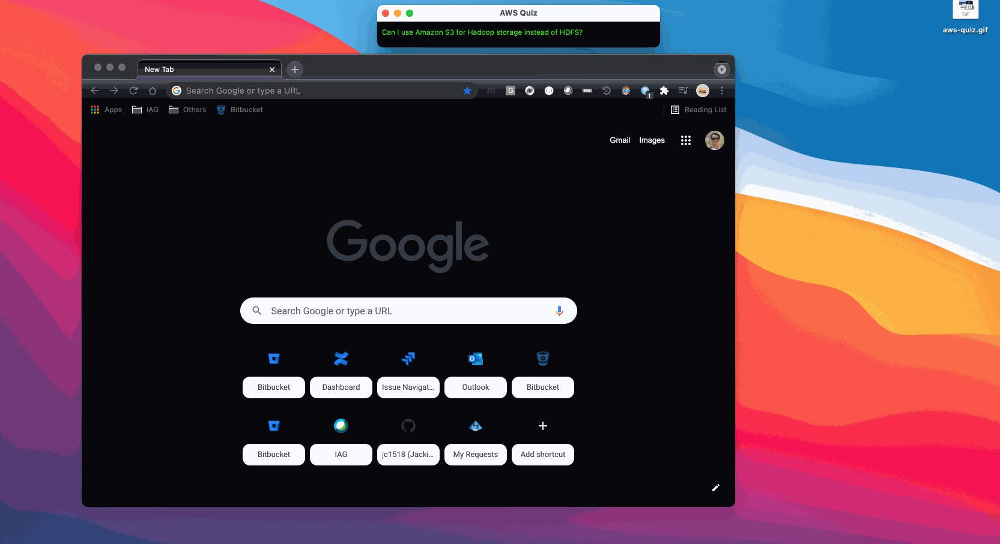

# AWS-Quiz

My first Typescript + NodeGui project. This little application randomly picks a question from the AWS Knowledge Center.



## Usage

- Single click - skip anwer and go to next question
- Double click - show answer and go to next question

## Install Requirements (MacOS)
```
brew install cmake
brew install make
npm install
```

## Run application
```
npm start
```

## Build application for distribution
```
npx nodegui-packer --init AWS-Quiz (#Only for the first time)
npm run build
npx nodegui-packer --pack ./dist
```